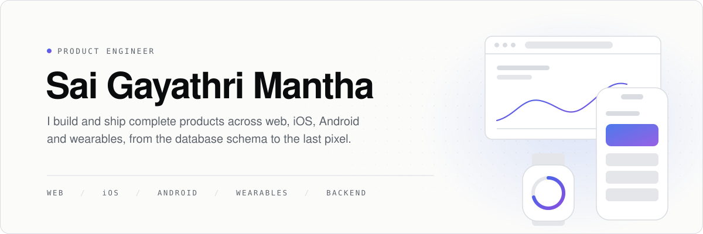

<picture>
  <source media="(prefers-color-scheme: dark)" srcset="assets/header-dark.svg">
  
</picture>

  <a href="https://gayathrimantha.com">gayathrimantha.com</a>&nbsp;&nbsp;·&nbsp;&nbsp;<a href="https://www.linkedin.com/in/sai-gayathri-mantha-064b50179/">LinkedIn</a>

 

### What I build

**Web apps and sites** 
React, Next.js, TypeScript. Marketing sites, dashboards, admin consoles, SaaS products. Static, server-rendered, localized.

**Mobile apps** 
React Native for iOS and Android, plus native Swift and Kotlin when the platform needs it: widgets, voice assistants, store billing, push notifications.

**Wearables** 
Apple Watch and Wear OS companion apps that stay in sync with the phone.

**Backends** 
Node, Express, TypeScript, SQL, Redis. APIs, auth, payments, background jobs, admin tooling.

**Product and design** 
Figma to shipped UI. I hold my own work to a design-led quality bar.

 

### Recent work: Hushelo

A baby tracker that tells parents what to do next. One codebase per surface, all built by me.
[hushelo.com](https://hushelo.com)

 

### How I work

I own the whole product: data model, API, web, mobile, native extensions, billing and launch. I care about the details users never notice until they break, such as sync conflicts, deep links and privacy that is real.

`TypeScript` `React` `Next.js` `React Native` `Swift/SwiftUI` `Kotlin` `Node/Express` `MySQL/MariaDB` `MongoDB` `Redis` `Figma`

 

### Work with me

Available for web, mobile and full-stack product work.
[Upwork](https://www.upwork.com/freelancers/~01d2cd692aefe55512) · [Email](mailto:gayathrimantha16@gmail.com)
